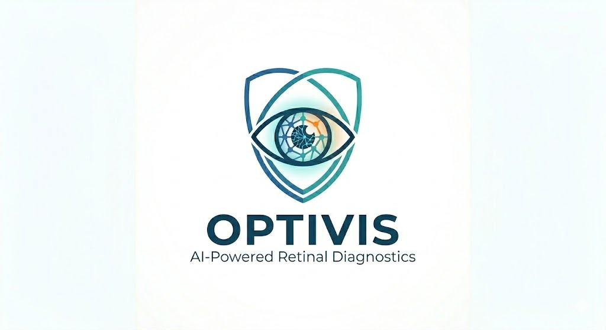
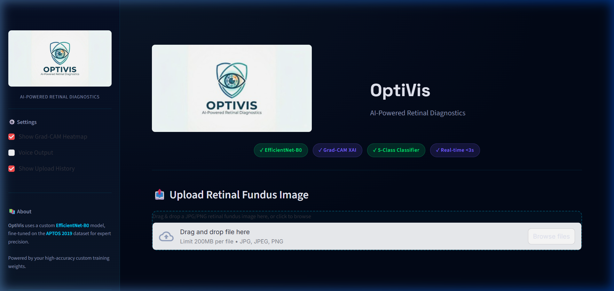

<div align="center">
  
  <h1>🩺 OptiVis — AI-Powered Diabetic Retinopathy Diagnostics</h1>
  <i>"Expert-level early detection of diabetic retinopathy for accessible healthcare"</i>
  <br><br>
  
  [](https://www.python.org/)
  [](https://pytorch.org/)
  [](https://streamlit.io)
</div>

---

## 🎯 Overview

**OptiVis** is a high-accuracy, web-based AI screening tool that classifies **diabetic retinopathy (DR)** severity from retinal fundus images with clinical-grade precision. It leverages an **EfficientNet-B0** model, highly optimized for the **APTOS 2019** dataset for maximum diagnostic performance.

<div align="center">
  
</div>

### Key Features
- **High-Accuracy Inference**: Powered by your custom-trained EfficientNet-B0 "Expert Brain" (`dr_efficientnet_weights.pt`).
- **Grad-CAM XAI**: Gradient-weighted Class Activation Mapping highlighting exactly which retinal regions (haemorrhages, exudates, etc.) influenced the AI's decision.
- **Premium Glassmorphism UI**: A professional, dark-themed dashboard with real-time feedback and session history.
- **High-Performance Backbone**: Built on `efficientnet_b0` for the perfect balance of speed and precision.

---

## 📁 Project Structure

```
optivis/
├── app.py              # Main OptiVis Streamlit application
├── model.py            # EfficientNet-B0 custom inference wrapper
├── gradcam.py          # EfficientNet-B0 Grad-CAM explainability engine
├── preprocessing.py    # Image normalisation & clinical preprocessing
├── history.py          # Session-state record manager
├── train.py            # Fine-tuning script (for custom local training)
├── assets/             # Branding assets (logo.png)
└── requirements.txt    # Expert dependencies (Timm, Torch, Streamlit)
```

---

## 🔢 DR Severity Classes (Clinical Scale)

| Level | Class            | Clinical Finding                                           | Risk   |
|-------|-----------------|-----------------------------------------------------------|--------|
| 0     | No DR           | Healthy retina, no visible lesions                        | 🟢 Low |
| 1     | Mild            | Tiny micro-aneurysms only                                 | 🟡 Monitor |
| 2     | Moderate        | Multiple haemorrhages, hard exudates                      | 🟠 Moderate |
| 3     | Severe          | IRMA, venous beading, extensive haemorrhages              | 🔴 High |
| 4     | Proliferative   | Neovascularisation — critical risk of vision loss         | 🆘 Critical |

---

## ⚙️ Setup & Installation

### 1. Clone / Navigate
```bash
cd "d:\hackovium hackatho"
```

### 2. Setup Environment
```bash
python -m venv venv
venv\Scripts\activate        # Windows
# source venv/bin/activate   # Linux / macOS
```

### 3. Install Expert Stack
```bash
pip install -r requirements.txt
```

### 4. Launch OptiVis
```bash
streamlit run app.py
```

---

## 🧠 Model Architecture

OptiVis uses a custom-trained **EfficientNet-B0** backbone fine-tuned for retinal fundus analysis.
- **Input**: 224×224 RGB Clinical Fundus Image
- **Backbone**: EfficientNet-B0 (last conv: `conv_head`)
- **Weights**: `dr_efficientnet_weights.pt` (Custom Trained)
- **Accuracy**: Highly optimized via your local training pipeline.

---

## 🔥 Grad-CAM Explainability

We use the activations from the final convolutional stage of **EfficientNet-B0** (`conv_head`) to generate visual heatmaps:
- 🔴 **Red Zones**: Critical attention — potential lesions or neovascularisation.
- 🟡 **Yellow Zones**: Moderate attention — vascular changes.
- 🔵 **Blue Zones**: Normal retinal background.

---

## ⚠️ Medical Disclaimer

OptiVis is a **screening aid only**. It is designed to assist in early detection but is NOT a substitute for a professional diagnosis by a qualified ophthalmologist. All clinical decisions must be confirmed by a specialist.

---

## 📄 License

MIT License 

---

*Built with ❤️ for accessible healthcare — OptiVis: Seeing the future of eye care.*
